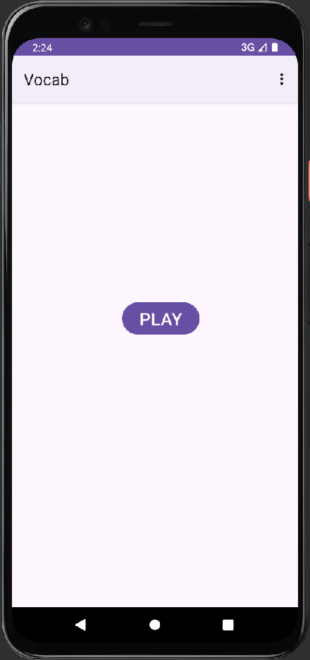
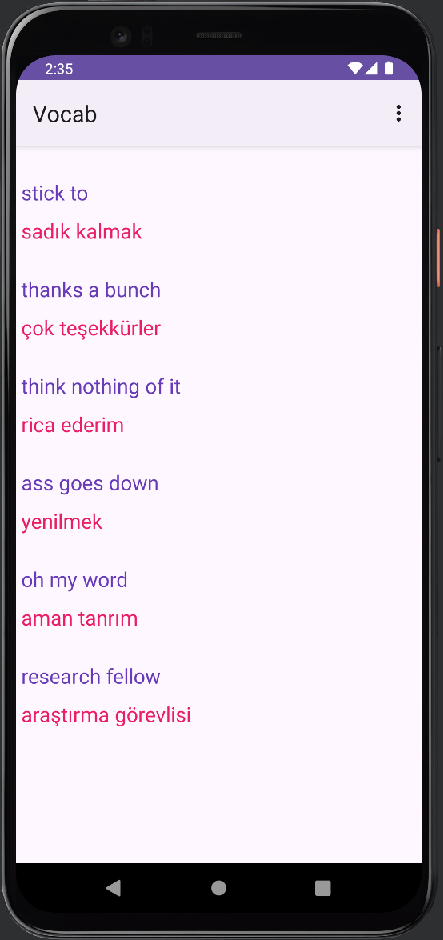
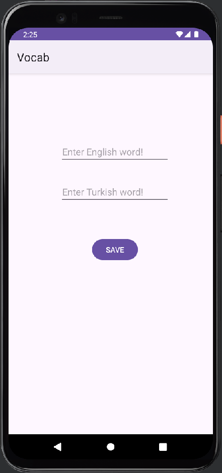
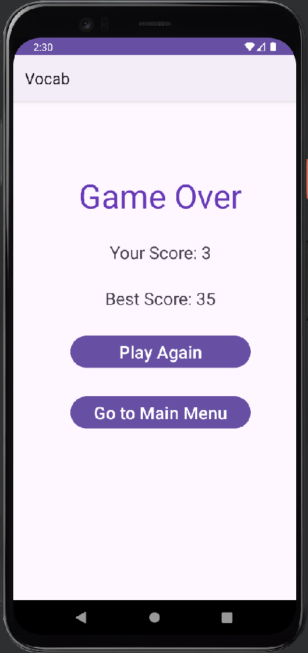

# 📚 Vocab - Vocabulary Learning App

Vocab is an Android application designed to make vocabulary learning easier and more enjoyable. With Firebase integration, you can create user accounts, save your words, and practice in game mode.

## ✨ Features

- 🔐 Secure login system with Firebase Authentication
- 📝 Word adding and editing
- 🎮 Word practice in game mode
- 📊 Level system
- 🏆 Score tracking
- 🎯 Different difficulty levels
- 💾 Store words in Firebase

## 🛠️ Technologies Used

- Kotlin
- Firebase (Authentication, Firestore)
- Navigation Component
- ViewBinding
- RecyclerView
- Material Design

## 🚀 Installation

1. Clone the project:
```bash
git clone https://github.com/Brkcidem/Vocab.git
```

2. Open the project in Android Studio

3. Create your Firebase project:
   - Go to [Firebase Console](https://console.firebase.google.com)
   - Create a new project
   - Register your Android app
   - Download the `google-services.json` file
   - Place the downloaded file in the `app` folder

4. Run the application

## 📱 Screenshots

### Login Screen


### Main Screen


### Word List


### Add Word


### Game


### Score Board


## 🔧 Development

To contribute to the project:

1. Create a new branch
2. Make your changes
3. Submit a pull request

## 📝 License

This project is licensed under the MIT License. See the [LICENSE](LICENSE) file for details.

## 👤 Author

Burakhan Çidem - [GitHub](https://github.com/Brkcidem)

## 🙏 Acknowledgments

- Firebase team
- Android developer community
- All contributors